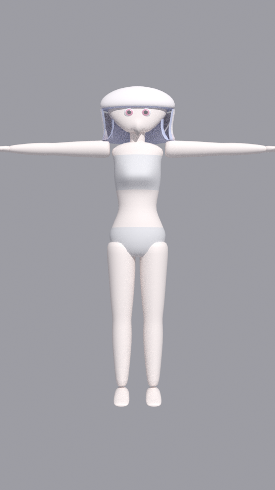
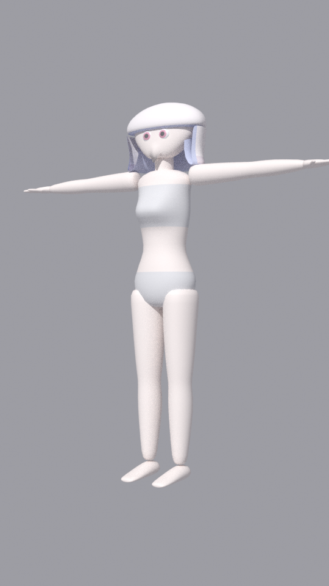
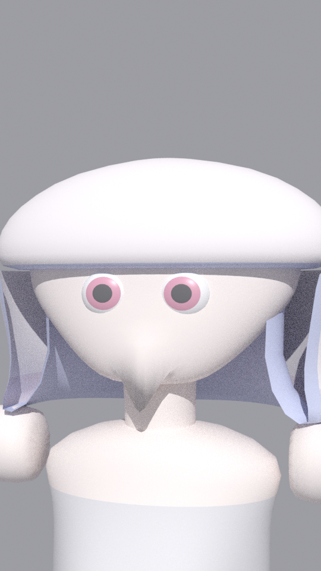

# vrchat-avatar

参考資料 (`reference/`) のキャラクターを VRChat 向け avatar として制作する project。Blender の Python (bpy) で素体 mesh、Unity Humanoid 互換の armature、bone weight、viseme とまばたきの shape key を手続き的に生成し、FBX と .blend を書き出す。生成結果は Blender GUI で顔と髪を作り込むための出発点であり、参考資料の顔と髪を厳密に再現するものではない。

## 構成

```
avatar/params.py        寸法と配色の単一情報源
avatar/loft.py          断面列から筒状 mesh を作る loft (bpy 非依存)
avatar/mesh_builder.py  複数の loft を 1 つの mesh object にまとめる
avatar/body.py          素体 (胴体、頭部、四肢、手、足、眼球)
avatar/hair.py          髪 (ボブ、前髪、サイドロック、インナーハイライト)
avatar/rig.py           Unity Humanoid 互換 armature
avatar/shapekeys.py     viseme とまばたきの shape key
avatar/materials.py     base color だけを持つ material
avatar/build.py         生成手順全体
scripts/                blender -b から呼ぶ入口 (生成、検証、描画)
docs/spec.md            キャラクター仕様と VRChat 向け要件
docs/workflow.md        生成から Unity への取り込みまでの手順
reference/              参考資料 (キャラクターシート)
build/                  生成物 (git 管理外)
```

## 使い方

Blender は [sabas0ba/dotfiles](https://github.com/sabas0ba/dotfiles) の `vrchat` profile から取る。

```bash
nix develop /path/to/dotfiles#vrchat
make check      # 構文検査、生成、FBX の検証
make preview    # build/preview/*.png を描画する (Cycles CPU)
make build-quest  # subdivision 無しの低 polygon 版を build/quest に生成する
```

`make build` は `build/avatar.fbx`、`build/avatar.blend`、`build/report.json` を出力する。`BLENDER=/path/to/blender` で実行ファイルを指定できる。

## 生成物の外観

`make docs-images` が `build/preview/` から取り込んだ画像。参考資料との差は「現状の制約」を参照する。

| 正面 | 3/4 | 顔 |
| --- | --- | --- |
|  |  |  |

## 生成物の規模

| 対象 | 三角形数 | 三角形数から見た rank の目安 |
| --- | --- | --- |
| `build/` (subdivision 1) | 約 25,000 | PC: Excellent |
| `build/quest/` (subdivision 0) | 約 6,000 | Quest: Excellent |

rank の閾値は [docs/spec.md](docs/spec.md) を参照する。

## 現状の制約

- 顔は滑らかな loft であり、鼻、口、瞼、まつ毛の形状を持たない。viseme とまばたきは頂点の変位による近似である
- 各部品は重なり合う閉じた殻であり、1 つの manifold ではない。retopology は Blender GUI での作業とする
- 衣服は material の割り当て (Underwear) だけで表現し、独立した mesh を持たない
- texture と UV の展開は行わない。UV は loft ごとの円筒展開を 4x4 の tile に配置したものである
