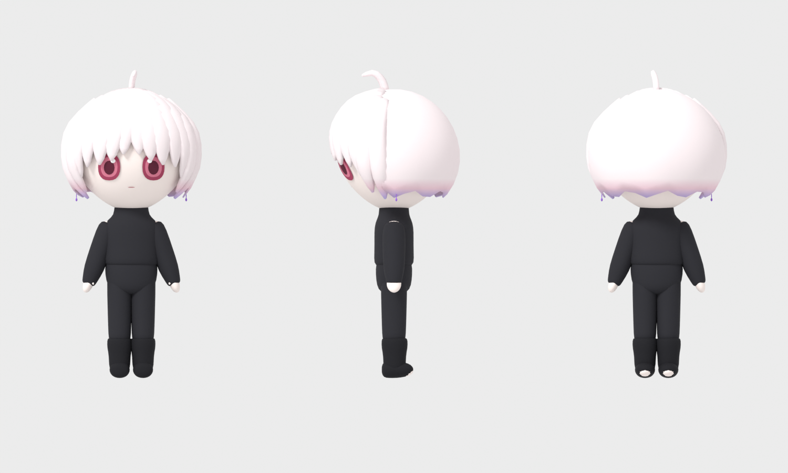
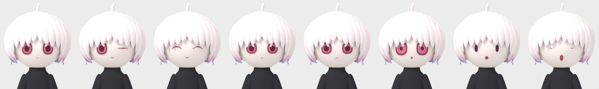

# sd-avatar

SD 頭身 (約 2.4〜2.5 頭身) キャラクターの VRChat 向け 3D model を、Blender の Python script で生成する。設定資料 (素体アウトライン、キャラクター設定) の比率と配色を単一情報源 `avatar/spec.py` に写し、素体、顔、髪、衣装、armature、shape key、texture、FBX までを再現可能に生成する。





## 生成物

`make build` で `build/` に次を出力する。

| ファイル | 内容 |
| --- | --- |
| `avatar.blend` | 部位ごとに object を分けた編集用 (Body, Face, Hair, Clothes, Armature) |
| `avatar.fbx` | Unity 向け。Body, Hair, Clothes を 1 つの skinned mesh に結合し、shape key を持つ Face は別 mesh |
| `textures/hair_gradient.png` | 髪の毛先 gradient (V 方向)。`avatar.fbm/` にも複製される |
| `render/*.png` | `make render` で生成する確認用画像 (三面図、表情、viseme) |

構成の要点は次のとおり。

- 全高約 0.97 m、頭部の高さ 0.40 m (2.42 頭身)
- Unity Humanoid 互換の bone (Hips, Spine, Chest, Neck, Head, Shoulder/UpperArm/LowerArm/Hand, UpperLeg/LowerLeg/Foot/Toes, Eye)。左右は `.L` / `.R`
- Face に VRChat の viseme 15 種 (`vrc.v_*`)、Blink / Blink_L / Blink_R、表情 (Wink, Smile, Angry, Sad, Surprised)、DotEyes の shape key
- 三角面数 約 30k (VRChat PC の Excellent 帯である 32k 以下)、材質 11

現状は block-out 段階の造形であり、髪の面構成や顔の印象は Blender の GUI で手作業による調整を前提とする。詳細は [docs/design.md](docs/design.md)、Unity 側の手順は [docs/unity-setup.md](docs/unity-setup.md) を参照する。

## 開発環境

Nix flake が Blender 5.1、Python 3.13、ruff を固定する。

```bash
nix develop            # または direnv: .envrc に `use flake` を置き direnv allow
make help
```

Nix を使わない場合は Blender 5.1 系を導入し、`BLENDER=/path/to/blender make build` のように実行ファイルを指定する。生成 script は Blender 同梱の Python で動作し、追加の Python package を必要としない。

## 操作

```bash
make build     # モデルを生成する (build/avatar.blend, build/avatar.fbx)
make render    # 確認用画像を生成する (build/render/)
make verify    # 生成した .blend の構成を検査する
make test      # bpy 非依存部の unit test
make lint      # ruff check / format --check
make check     # lint, test, build, verify をすべて実行する
```

headless の render は Cycles (CPU) を使う。EEVEE と Workbench は GPU context を要求するため、display のない環境では動作しない。

## 構成

```
avatar/spec.py        寸法、bone 配置、配色、shape key の一覧 (単一情報源)
avatar/geometry.py    loft / tube / disk による mesh 生成 (bpy 非依存)
avatar/weights.py     bone chain への射影による weight 計算 (bpy 非依存)
avatar/body.py        素体
avatar/face.py        顔パーツの設計形状
avatar/shapekeys.py   shape key の変形定義
avatar/hair.py        髪
avatar/clothes.py     衣装とピアス
avatar/png.py         gradient texture の書き出し (bpy 非依存)
avatar/bl_*.py        Blender 内での object、armature、材質の生成
avatar/build.py       生成手順の全体
avatar/export.py      FBX 書き出し
avatar/render.py      確認用 render
scripts/              Blender から実行する entry (build, render, check_model)
tests/                unit test (plain python3 で実行する)
docs/                 設計と Unity 手順
```

## License

未定。
